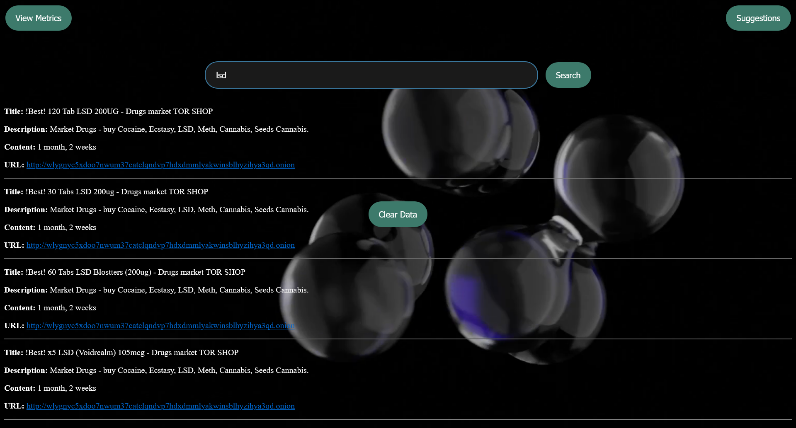

# darklight
darkweb search and metrics, btc,finance interface

 

The darklight engine is primarily a search engine for the tor network (darknet) that returns url's for hidden services
via keyword search.
 
Similar to Ahmia search but unlike Ahmia there is no clearweb equivalent and darklight has 'built in 'tor metrics' ...
 
No 'login' , 'api keys' required ; no serverside analytics are used , no trackers , no cookies and no adverts.
 

Tor metrics uses a custom made , internal api , which is available to the user to both search and access without the need
of an api key . 
- the api is quite large therefore accessing it directly may require patience due to the architecture of the tor network.
 
The tor-api can be searched via 'metrics.html' and 'server.html' using both relay names or server ip addresses.
 
Additional built in functionality enables search of 'wikipedia' , 'archive.org' 'gutenburg.org' ,sourceforge.net,
and github.com .
 
There is also a 'Dark Markets Archive ' and a Finance section.
 
The darklight engine has access to billions of data points and url's.
  

<h3>The main user interfaces are;Tor Search , Tor Metrics, Tor Servers.</h3>
 
(search.html,metrics.html,server.html)
 
search tor; darknet keyword search returns onion urls as clickable links...1.25k data files (data...(search by 'keyword' or 'phrase'. ie:"dark market"
 
search relays ; search tor api for darknet relay details 8.5k...(internal api-'tor-api.json')...(search by 'relay'name.ie:"technofobe")
 
search servers; search server details of the tor network 8.5k...(data)...(search by 'ip address'.ie: "5.189.155.39")
 
(Results for above are returned via Tor api/darklightdb).
 
<h3>Whois search:</h3> (whois.html) whois search using domain name or ip address...(external api)
 
<h3>Wiki search:</h3> search wikipedia   (wiki.html) 6.85 million articles in english    (search 'keyword' or 'phrase'.)                                     
 
<h3>Gutenberg search:</h3> search library of online books  (libris.html) 74k classic and out of print books (search by 'title' or 'author'.)
 
<h3>Archive search:</h3>(wayback.html) search wayback machine 
collections of 'software','movies','images', 'books','web' and 'audio'. 
(search fields ; movies, books, software, audio, image, web 
followed by search query.ie 'movies' 'sci fi'  will return all collections containing 'sci fi movies'.)
 																								  

410 billion web pages (accessible via the Wayback Machine) 
  
35 million research articles and scholarly documents (via Internet Archive Scholar)
 
20 million books and texts.
 
4.5 million audio recordings (including 180,000 live concerts and radio broadcasts)
	 			
(Results for above are returned via dynamic iframe).
  
				
				
<h3>Sourceforge search :</h3> (sourceforge.html) utilizes darklight's sourceforge api
to provide current data related to any sorceforge project
approx 550,000 software projects for download.
 
(Results for above are returned via hypertxt links to 'download'.)
 
<h3>Darknet market archives :</h3> (archive.html) archived data regarding early darknet markets including clone of the original
'silk road 1 'hidden service.(2011).
50GB (~1.6TB uncompressed) collection covering 89 DarkNet Markets & 37+ related forums, representing over 4,438 mirrors.   
 
<h3>Guru api search :</h3> (api-data.html) list of api's compiled by 'https://apis.guru/' .Filter 2,529 APIs  ...
 
(Results for above are returned via internal data)	
 
<h3>Git hub :</h3>  (git.html) searches the largest 'binaries' (code) repo in the world using AJAX requests and returns results as clickable links:
 
The search function uses keywords to access repository data and returns hyper txt links to each repo , login may be required
by git hub in order to 'clone' the repo you have selected.
 
Method for cloning github repo's using commandline (no login) ; 
 
1. Search by keyword.(git.html)
2. Right click on the repo link of the search results and select 'copy link'.
3. paste link into txt editor , eg , https://github.com/Mulc1b3R/genesis
4. add '.git' to url ; https://github.com/Mulc1b3R/genesis.git
5. open 'powershell' as 'admin' on yr machine and 'cd' to required	location you want as the destination of the files.
6. in powershell,paste ; git clone https://github.com/Mulc1b3R/genesis.git   (for example)
7. press return key.
8. The code from the requested repo will download to yr selected destination.
 

<h3>Finance section:</h3> 
 
(finance.html)sends api requests for any stock ticker or etf. Lists of which can be found in the interface.
 
search results include:
 
Ticker quotes for stocks and etf's (100k) , top gainers and losers,options chains,finance news and feeds, company profiles, ratings, charts, company growth,
key metrics, income statements, balance sheets , SEC filings , Cryptocurrency quotes, etc.
 
Comprhensive lists of all stock tickers, etf's and crypto are available at the click of a button.
 
(Results for above are returned via various api's, both internal and external ,note that results returned as clickable links,
such as SEC filings and Options chains ,if clicked, will take you to the clearweb as there is no workable method of displaying the 
data at this present time.The method i chose to use enables the user to search SEC filings by keyword remotely , as for the options chains,
Human readability is an issue for most people so i employ an alphabetic solution , where the user can browse all avaiable
options chain names as hypertxt links from the safty of TOR , prior to requesting the dynamic data from CBOE.)
 
All in all , the Darklight Engine is the "Swiss Army Knife" of the darkweb.
 
Enabling tor users to navigate the network and retrieve data in all formats from the safety of the 'Onion Router'.
 
If you have a hidden service and would like it adding to the "suggestions' list of the main search page , contact :
 
disobay@proton.me 
 
With the "name" and "onion url" ,it will be added to our 'recomendations' and made visible to users of The search engine. 
 
Mulciber
